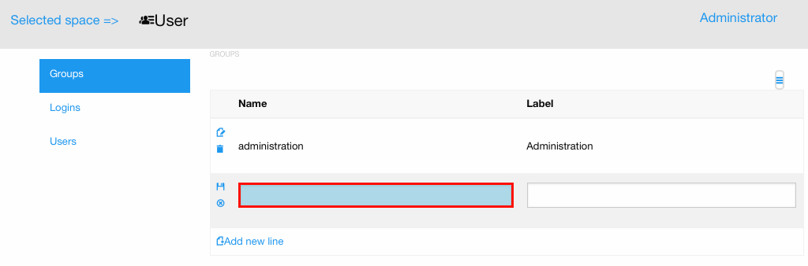
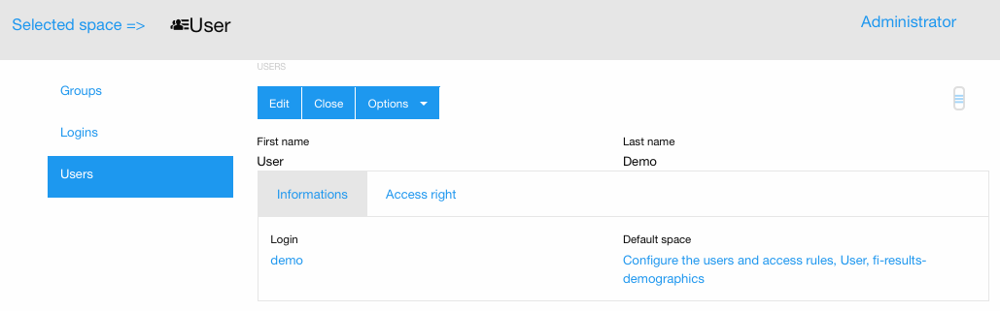

.. image:: https://travis-ci.org/ERPBlok/ERPBlok.svg?branch=master
    :target: https://travis-ci.org/ERPBlok/ERPBlok
    :alt: Build status

.. image:: https://coveralls.io/repos/github/ERPBlok/ERPBlok/badge.svg?branch=master
    :target: https://coveralls.io/github/ERPBlok/ERPBlok?branch=master
    :alt: Coverage

.. .. image:: https://img.shields.io/pypi/v/ERPBlok.svg
..    :target: https://pypi.python.org/pypi/ERPBlok/
..    :alt: Version status
   
ERPBlok
=======

ERPBlok provide a way to manage business applications on top of `Anyblok 
<http://doc.anyblok.org>`_ adding a Graphic User Interface based on
`React <https://facebook.github.io/react/>`_ and `Foundation 
<http://foundation.zurb.com/>`_

* `Documentation <http://docs.anybox.fr/erpblok/default/index.html>`_
* `Continious integration <http://buildbot.anyblok.org/waterfall>`_

Preview
-------

Inline list view:

|inline_list_view|

Form view:

|form_view|

License
-------

AGPL v3 without clause (May change according the community requests)

Project state
-------------

Active development.

Todo
----

* add search view
* manage authorizations
* improve code base stability
* Dialog view
* Adding more field widgets (Datetime, Color, Email, ...)
* Adding more view types (Diagramme, Kanban, Custom, ...)
* ...

