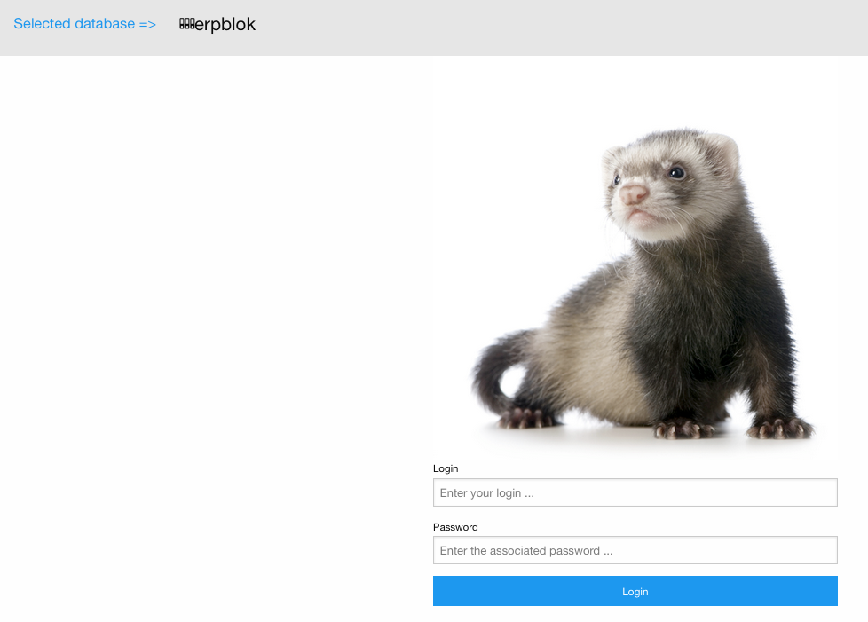
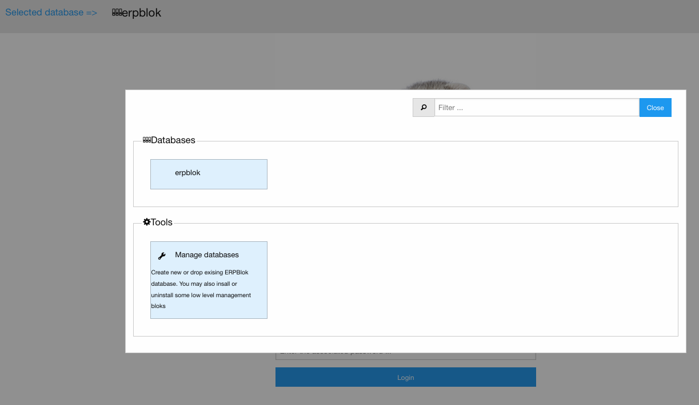
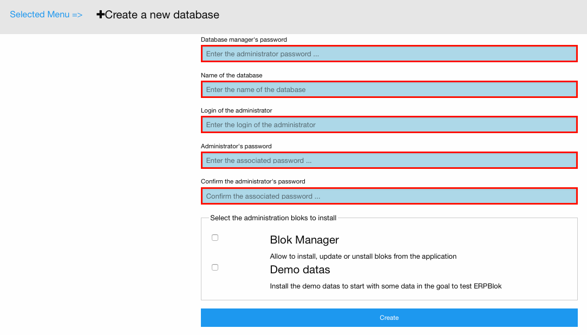
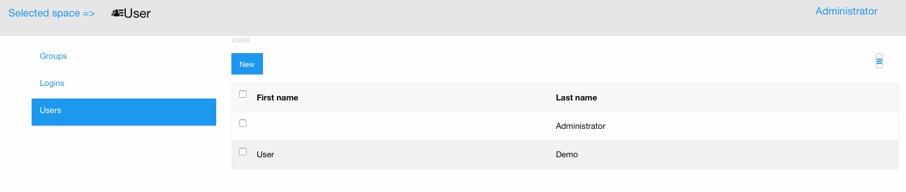

Your first ERPBlok's installation
---------------------------------

The goal is to have a running ERPBlok on the system.

Build the environment and run the server
~~~~~~~~~~~~~~~~~~~~~~~~~~~~~~~~~~~~~~~~

1) Create a virtualenv::

    pyvenv-3.5 erpblok-env

2) Install erpblok::

    erpblok-env/bin/pip install erpblok

3) Choose the BDD

    .. warning::

        In my case, I choose to use ``postgresql``.
        Read the `installation guides <https://wiki.postgresql.org/wiki/Detailed_installation_guides>`_

::
    erpblok-env/bin/pip install psycopg2

4) Write a logging configuration file. (example: mylogger.cfg)::

    [loggers]
    keys=root, anyblok, erpblok, anyblok_pyramid
    
    [handlers]
    keys=consoleHandler
    
    [formatters]
    keys=consoleFormatter
    
    [logger_root]
    level=INFO
    handlers=consoleHandler
    
    [logger_anyblok]
    level=INFO
    handlers=consoleHandler
    qualname=anyblok
    propagate=0
    
    [logger_anyblok_pyramid]
    level=INFO
    handlers=consoleHandler
    qualname=anyblok_pyramid
    propagate=0
    
    [logger_erpblok]
    level=INFO
    handlers=consoleHandler
    qualname=erpblok
    propagate=0
    
    [handler_consoleHandler]
    class=StreamHandler
    level=INFO
    formatter=consoleFormatter
    args=(sys.stdout,)
    
    [formatter_consoleFormatter]
    class=anyblok.logging.consoleFormatter
    format=%(database)s:%(levelname)s - %(name)s:%(message)s
    datefmt=

5) Write a configuration file for ERPBlok. (example: myerpblok.cfg)::

    [AnyBlok]
    # select a default database name
    db_name = erpblok
    # AnyBlok load at the postgresql BDD, with the default parameter
    # - unix socket: 5432
    # - default user / password
    db_driver_name = postgresql
    # define a dirstory to save the session's file
    beaker.session.data_dir = erpblok.session
    # Use the logging configuration
    logging_configfile = mylogger.cfg
    # Gice access to the database manager for create or drop database.
    allow_database_manager = true
    # Define a database manager password
    db_manager_password = mysecretpassword
    # filter the database seen by erpblok
    db_filter = %%erpblok%%

6) Start the gunicorn server::

    erpblok-env/bin/gunicorn_anyblok_pyramid --anyblok-configfile myerpblok.cfg -b localhost:8080 -w 4
    ==> AnyBlok Load init: EntryPoint.parse('load_config = erpblok:load_config')
    ==> Load config file '/Library/Application Support/AnyBlok/conf.cfg'
    ==> Load config file '/Users/jssuzanne/Library/Application Support/AnyBlok/conf.cfg'
    ==> Load config file '/Users/jssuzanne/erpblok/erpblok/myerpblok.cfg'
    ==> [2016-03-17 10:14:29 +0100] [20234] [INFO] Starting gunicorn 19.4.5
    ==> [2016-03-17 10:14:29 +0100] [20234] [INFO] Listening at: http://127.0.0.1:8080 (20234)
    ==> [2016-03-17 10:14:29 +0100] [20234] [INFO] Using worker: sync
    ==> [2016-03-17 10:14:29 +0100] [20237] [INFO] Booting worker with pid: 20237
    ==> No database:INFO - anyblok.blok:BlokManager.load
    ==> [2016-03-17 10:14:29 +0100] [20238] [INFO] Booting worker with pid: 20238
    ==> No database:INFO - anyblok.blok:BlokManager.load
    ==> [2016-03-17 10:14:29 +0100] [20239] [INFO] Booting worker with pid: 20239
    ==> No database:INFO - anyblok.blok:BlokManager.load
    ==> [2016-03-17 10:14:29 +0100] [20240] [INFO] Booting worker with pid: 20240
    ==> No database:INFO - anyblok.blok:BlokManager.load
    ==> No database:INFO - anyblok_pyramid.common:Preload the databases : erpblok
    ==> No database:INFO - anyblok_pyramid.common:Preload the database : 'erpblok'
    ==> No database:WARNING - anyblok_pyramid.common:The database 'erpblok' does not exist
    ==> No database:INFO - anyblok_pyramid.common:Preload the databases : erpblok
    ==> No database:INFO - anyblok_pyramid.common:Preload the database : 'erpblok'
    ==> No database:WARNING - anyblok_pyramid.common:The database 'erpblok' does not exist
    ==> No database:INFO - anyblok_pyramid.common:Preload the databases : erpblok
    ==> No database:INFO - anyblok_pyramid.common:Preload the database : 'erpblok'
    ==> No database:WARNING - anyblok_pyramid.common:The database 'erpblok' does not exist
    ==> No database:INFO - anyblok_pyramid.common:Preload the databases : erpblok
    ==> No database:INFO - anyblok_pyramid.common:Preload the database : 'erpblok'
    ==> No database:WARNING - anyblok_pyramid.common:The database 'erpblok' does not exist

Congrats your have start your own ERPBlok's server

Create your first database
~~~~~~~~~~~~~~~~~~~~~~~~~~

1) In your favorite browser call the url ``localhost:8080``

If you have an existing database, you show the login page

Click on the link **Selected database =>**, then click on **Manage databases**.

Else you will redirect to database manager page.

2) Fill the formulaire and click on **create** button.

.. warning:: 

    It is may take some minute, but it is not display.

Congrats you have your first ERPBlok's base !!!
